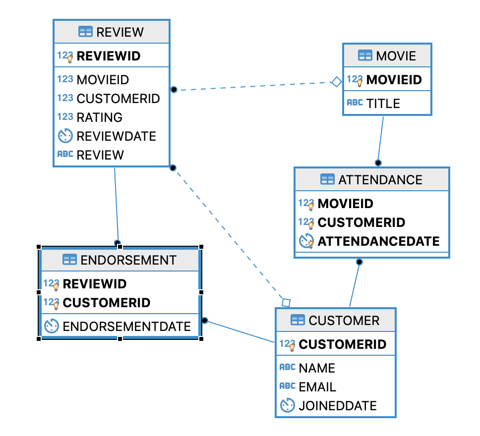

# Final Project 
- Create a database for Giving movies review, ranking of reviews for customers
- Created by HoKang Yu & Annie Lin 

# Procedure / Road Map
1. include derby.jar in the classpath, build path
2. run [setdefaultdata.java], this will initial all the tables, functions, constraints, etc
3. run [mainpage.java]
4. then have fun!

# Classes
1. Connection: create connection to a databasea
2. CreateTable: create tables/functions/database
3. SetDefaultdata: This will run createtable.java, then read all the text files for default dated
4. MainPage: this the main page of the gui (give users options)
5. Customer view: provide all the options that customer can access
6. Employee view: provide all the options that employees can access
7. dbFunction: all the assist functions that are needed for creating table
  - dbFunctions shall be able to reject and print data that violate table's rule
8. uiFunctions: all the asist functions needed for mainpage,customerview, and employeeview
  - UIFunctions should be able to reject bad input (email, options, dates, etc)

# TextFiles
- [ customer.txt, review.txt, endorsement.txt, employee.txt, attendance.txt ]
- These are all the files that provides pseudo data
- These files are needed to run setdefaultdata.java

# Highlights of the project
1. when creating tables, tables will call functions that are stored in database
2. functions are all java functions
3. functions also retrieve data from other tables

# The Design (Entity-Relationship) Diagram 

- Additional information can be found in the slide
https://prezi.com/p/a__4rkcgv4k1/finalproject/

# Tables
Tables: { Customer, Movie, Attendance, Review, Endorsement }
- Customer: Customer_id (pk), name, email, joined_date
- Movie: Title (pk), movie_id
- Attendance: movie_id, customer_id, attendance_date
- Review: review_id, rating, customer_id, movie_id, review_date
- Endorsement: review_id, customer_id (endorser_id), endorsement_date
- [ Detail information can be found in the pretzi link above ] 

# Stored Functions
{ checkReviewOnce, CheckReviewTable, CheckEndorsementTable }
- CheckReviewOnce: Each Customer can only make 1 review per movie
- CheckReviewTable: Check if customer has attended the movie within 7 days 
- CheckEndorsementTable: // this stored function calls 3 other functions to check validlty
  1. Check if endorser is endorsing him/herself
  2. Check if endorsement is date is within 3 days of the review
  3. Check if there is 1 day apart after endorsing another review of the same movie

# Triggers
Originally, we had a table that contains information about customer and if a customer receives any gift; this table has triggers that could auto update information when some data is inserted in other table. However, we found this design would be poor and unnecessary. Instead, when an user wants to see the information of who gets free gift and ticket, we just run a query in UIFunctions.java and print the result of query. In this case, we do not need an extra table or any trigger. Triggers in derby also have limited ability comparing to mysql. So we changed our design to maximize utility.

